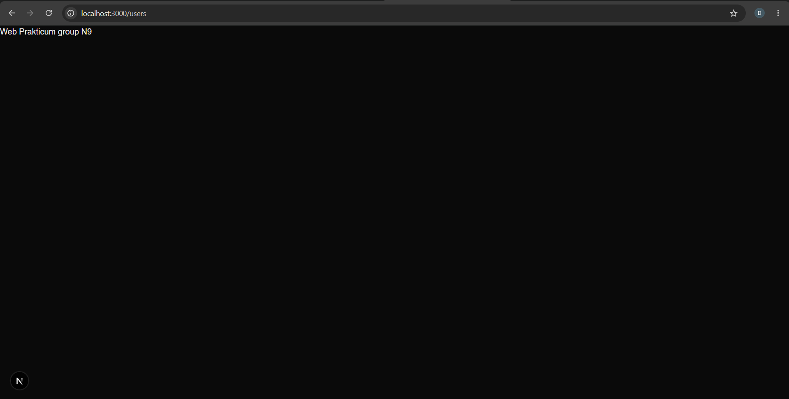
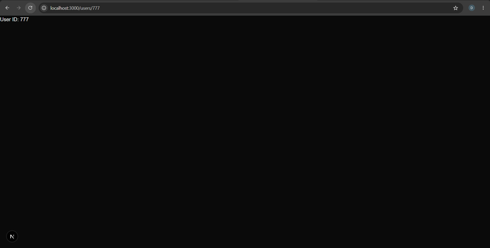
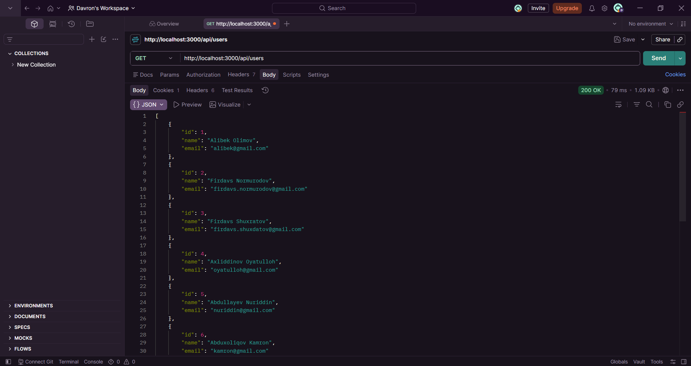
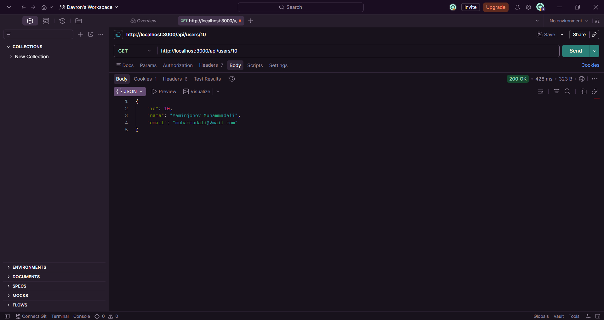
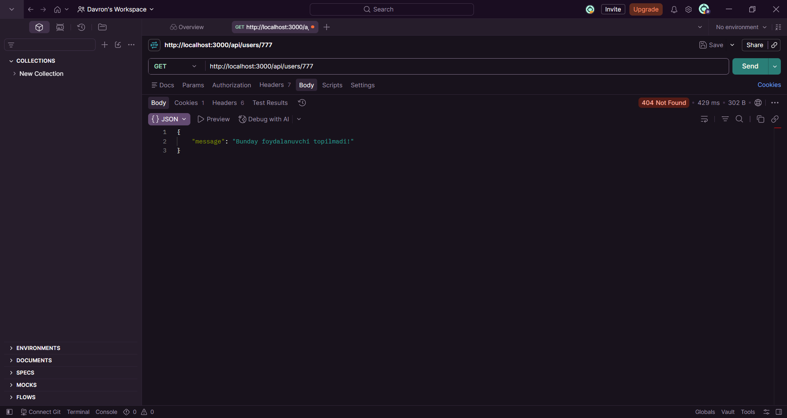

# Next.js Routes

A simple Next.js project for practicing page routes, dynamic routes, and API Route Handlers. | Page route'lar, dynamic route'lar va API Route Handler'lar bilan ishlashni mashq qilish uchun yaratilgan sodda Next.js loyihasi.

---

## Task | Vazifa

Create four routes using the Next.js App Router. | Next.js App Router yordamida to'rtta route yaratish.

```text
GET /users
GET /users/:id
GET /api/users
GET /api/users/:id
```

The routes were tested in the browser and Postman. | Route'lar brauzer va Postman orqali test qilindi.

---

## Routes | Route'lar

### 1. GET /users

Displays the users page. | Users sahifasini ko'rsatadi.

```text
http://localhost:3000/users
```

---

### 2. GET /users/:id

Displays the user ID received from the URL using a dynamic route. | Dynamic route yordamida URL orqali kelgan user ID'ni ko'rsatadi.

Example | Misol:

```text
http://localhost:3000/users/777
```

Result | Natija:

```text
User ID: 777
```

---

### 3. GET /api/users

Returns the list of all users in JSON format. | Barcha userlar ro'yxatini JSON formatida qaytaradi.

```text
http://localhost:3000/api/users
```

Example response | Javob namunasi:

```json
[
  {
    "id": 1,
    "name": "Alibek Olimov",
    "email": "alibek@gmail.com"
  },
  {
    "id": 2,
    "name": "Firdavs Normurodov",
    "email": "firdavs.normurodov@gmail.com"
  },
  {
    "id": 3,
    "name": "Firdavs Shuxdatov",
    "email": "firdavs.shuxdatov@gmail.com"
  }
]
```

---

### 4. GET /api/users/:id

Returns a single user by ID in JSON format. | ID bo'yicha bitta userni JSON formatida qaytaradi.

Example | Misol:

```text
http://localhost:3000/api/users/6
```

Example response | Javob namunasi:

```json
{
  "id": 6,
  "name": "Abduxoliqov Kamron",
  "email": "kamron@gmail.com"
}
```

---

## User Not Found | User Topilmadi

If a user with the requested ID does not exist, the API returns a `404 Not Found` response. | Agar so'ralgan ID bilan user mavjud bo'lmasa, API `404 Not Found` javobini qaytaradi.

Example | Misol:

```text
http://localhost:3000/api/users/100
```

Response | Javob:

```json
{
  "message": "User not found"
}
```

Status | Holat:

```text
404 Not Found
```

---

## Technologies | Texnologiyalar

| Technology | Purpose |
| --- | --- |
| Next.js | Framework |
| React | User interface |
| JavaScript | Programming language |
| Tailwind CSS | Styling |
| App Router | Routing |
| Route Handlers | API endpoints |
| Postman | API testing |

The project uses the Next.js App Router for page and API routing. | Loyiha page va API routing uchun Next.js App Router'dan foydalanadi.

---

## Project Structure | Loyiha Strukturasi

```text
app/
├── api/
│   └── users/
│       ├── [id]/
│       │   └── route.js
│       └── route.js
│
├── users/
│   ├── [id]/
│   │   └── page.js
│   └── page.js
│
├── favicon.ico
├── globals.css
├── layout.js
└── page.js

screenshots/
├── 01-get-users.png
├── 02-get-user-by-id.png
├── 03-get-api-users.png
├── 04-get-api-user-by-id.png
└── 05-user-not-found.png

public/
package.json
README.md
```

---

## Installation | O'rnatish

### 1. Install dependencies | Paketlarni o'rnatish

```bash
npm install
```

### 2. Start the development server | Development serverni ishga tushirish

```bash
npm run dev
```

### 3. Open the project in the browser | Loyihani brauzerda ochish

```text
http://localhost:3000
```

The development server runs on port `3000` by default. | Development server odatda `3000` portda ishlaydi.

---

## API Endpoints | API Endpointlar

| Method | Endpoint | Description | Tavsif |
| --- | --- | --- | --- |
| GET | `/users` | Displays the users page | Users sahifasini ko'rsatadi |
| GET | `/users/:id` | Displays a dynamic user ID | Dynamic user ID'ni ko'rsatadi |
| GET | `/api/users` | Returns all users | Barcha userlarni qaytaradi |
| GET | `/api/users/:id` | Returns one user by ID | ID bo'yicha bitta userni qaytaradi |

---

## Testing | Testlash

All routes were tested using the browser and Postman. | Barcha route'lar brauzer va Postman yordamida test qilindi.

### 1. GET /users

Displays the users page successfully. | Users sahifasini muvaffaqiyatli ko'rsatadi.

```text
GET http://localhost:3000/users
```



---

### 2. GET /users/:id

Displays the ID passed through the dynamic URL parameter. | Dynamic URL parametri orqali berilgan ID'ni ko'rsatadi.

```text
GET http://localhost:3000/users/777
```



---

### 3. GET /api/users

Returns all users as JSON with a successful response. | Barcha userlarni JSON formatida muvaffaqiyatli qaytaradi.

```text
GET http://localhost:3000/api/users
```



---

### 4. GET /api/users/:id

Returns a single user that matches the requested ID. | So'ralgan ID'ga mos bitta userni qaytaradi.

```text
GET http://localhost:3000/api/users/10
```



---

### 5. User Not Found | User Topilmadi

Returns `404 Not Found` when the requested user does not exist. | So'ralgan user mavjud bo'lmasa `404 Not Found` javobini qaytaradi.

```text
GET http://localhost:3000/api/users/777
```



---

## HTTP Status Codes | HTTP Status Kodlari

| Status | Description | Tavsif |
| --- | --- | --- |
| `200 OK` | Request completed successfully | So'rov muvaffaqiyatli bajarildi |
| `404 Not Found` | Requested user was not found | So'ralgan user topilmadi |

---

## Dynamic Routes | Dynamic Route'lar

Next.js dynamic routes are created using square brackets in folder names. | Next.js'da dynamic route'lar papka nomida kvadrat qavslardan foydalanib yaratiladi.

```text
app/users/[id]/page.js
```

This route handles URLs such as: | Ushbu route quyidagi URL'larni qabul qiladi:

```text
/users/1
/users/6
/users/777
```

The API also uses a dynamic route. | API ham dynamic route'dan foydalanadi.

```text
app/api/users/[id]/route.js
```

This route handles API requests such as: | Ushbu route quyidagi API so'rovlarini qabul qiladi:

```text
/api/users/1
/api/users/6
/api/users/13
```

---

## API Response Format | API Javob Formati

The API returns data in JSON format. | API ma'lumotlarni JSON formatida qaytaradi.

Example | Misol:

```json
{
  "id": 6,
  "name": "Abduxoliqov Kamron",
  "email": "kamron@gmail.com"
}
```

If the requested user does not exist, an error message and `404` status are returned. | Agar so'ralgan user mavjud bo'lmasa, xatolik xabari va `404` status qaytariladi.

```json
{
  "message": "Bunday foydalanuvchi topilmadi!"
}
```

---

## Available Users | Mavjud Userlar

The project contains 13 sample users for testing the API routes. | Loyihada API route'larni test qilish uchun 13 ta namunaviy user mavjud.

Each user contains the following fields: | Har bir user quyidagi maydonlardan iborat:

```text
id
name
email
```

Example | Misol:

```json
{
  "id": 1,
  "name": "Alibek Olimov",
  "email": "alibek@gmail.com"
}
```

---

## Author | Muallif

**Davron Jurayev**

---

## Description | Tavsif

This project demonstrates page routing, dynamic routing, API Route Handlers, dynamic API routes, JSON responses, HTTP status codes, and API testing in Next.js. | Ushbu loyiha Next.js'da page routing, dynamic routing, API Route Handler'lar, dynamic API route'lar, JSON response'lar, HTTP status kodlari va API testlash bilan ishlashni ko'rsatadi.